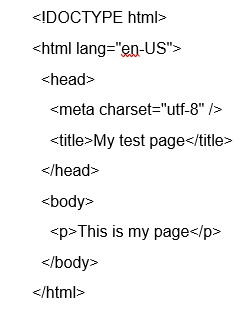

# ***Overview***

Before developers get to work designing websites, it's important they have ideal computer set ups, understand the basics, and apply solid programming fundamentals.

# **Class 2 Assignment**

1. Why is it important to use semantic elements in our HTML?

    Semantic elements give our code meaning.  Take for example \<h1>.  \<h1> is a semantic tag 
    that tells our page the text it wraps it’s a heading one element.  The \ tag on the other hand 
    is an inline container used to mark up a part of a text, or a part of a document, which does not give 
    our code meaning, and therefore not semantic.
    
   [Source: mdn web docs](https://developer.mozilla.org/en-US/docs/Glossary/Semantics)

2. How many levels of headings are there in HTML?

    There are six heading elements: \<h1>, \<h2>, \<h3>, \<h4>, \<h5>, and \<h6>. Each element represents a different level of content in     the document. \<h1> represents the main heading while subsequent tags represent subheadings.
    
    [Source: mdn web docs](https://developer.mozilla.org/en-US/docs/Learn/HTML/Introduction_to_HTML/HTML_text_fundamentals)

3. What are some uses for the \ and \ elements?

    Developers occasionally need superscript \ and subscript \ to mark dates, chemical formulas, and mathematical equations so     they have the correct meaning. 

    [Source: mdn web docs](https://developer.mozilla.org/en-US/docs/Learn/HTML/Introduction_to_HTML/Advanced_text_formatting)

4. When using the \<abbr> element, what attribute must be added to provide the full expansion of the term?

   A title attribute should be used to specify the element’s additional information.
   
   [Source: mdn web docs](https://developer.mozilla.org/en-US/docs/Learn/HTML/Introduction_to_HTML/Advanced_text_formatting) 

1. What are ways we can apply CSS to our HTML?

    CSS can be applied using external or internal stylesheets, and also by using inline styling.  '
    
    [Source: mdn web docs](https://developer.mozilla.org/en-US/docs/Learn/CSS/First_steps/How_CSS_is_structured)

 1. Why should we avoid using inline styles?

    We should avoid inline CSS styling for two reasons: 1) it is the least efficient implementation of CSS for maintenance. One styling change might require multiple edits within a single web page, and 2) inline CSS also mixes (CSS) presentational code with HTML and content, making everything more difficult to read and understand. Separating code and content makes maintenance easier for all who work on the website.
    
    [Source: mdn web docs](https://developer.mozilla.org/en-US/docs/Learn/CSS/First_steps/How_CSS_is_structured)

2. Review the block of code below and answer the following questions:

    The anatomy of our element is:

    The opening tag: Consists of the name of the element, wrapped in opening and closing angle brackets. This opening tag marks where the     element begins or starts to take effect. 
    The content: This is the content of the element. 
    The closing tag: The same as the opening tag, except it includes a forward slash before the element name. This marks where the           element ends. Failing to include a closing tag is a common beginner error that can produce peculiar results.

[Source: mdn web docs](https://developer.mozilla.org/en-US/docs/Learn/HTML/Introduction_to_HTML/Getting_started)

3. What is the Difference between \<article> and \<section> element tags?

    An \<article> tag encloses a block of related content that makes sense on its own without the rest of the page.  A \<section> tag is similar to \<article> tag, but it is more for grouping together a single part of the page that constitutes one single piece of functionality or a theme.

[Source: mdn web docs](https://developer.mozilla.org/en-US/docs/Learn/HTML/Introduction_to_HTML/Document_and_website_structure)

4. What Elements does a “typical” website include?

[Source: mdn web docs](https://developer.mozilla.org/en-US/docs/Learn/HTML/Introduction_to_HTML/Getting_started)

5. How does metadata influence Search Engine Optimization?
    Meta data descriptions includes keywords relating to the content of your page useful as it has the potential to make your page appear higher in relevant searches.

6. How is the <meta> HTML tag used when specifying metadata?

<meta name="singer" content="Luther Vandross" />

[Source: mdn web docs](https://developer.mozilla.org/en-US/docs/Learn/HTML/Introduction_to_HTML/The_head_metadata_in_HTML)

1. What is the first step to designing a Website?

    Project ideation and is the necessary first step to designing a website.  You should answer before anything else: 1) What exactly do I want to accomplish? 2) How will a website help me reach my goals? 3) What needs to be done, and in what order, to reach my goals?

2. What is the most important question to answer when designing a Website?

    What exactly do I want to accomplish?

[Source: mdn web docs](https://developer.mozilla.org/en-US/docs/Learn/Common_questions/Thinking_before_coding)

1.	Why should you use an \<h1> element over a  element to display a top-level heading?

    Using \ will render it to look like a top level heading, but it’ll lack semantic value, and not get any extra benefits

2.	What are the benefits of using semantic tags in our HTML?

    Search engines will consider its contents as important keywords to influence the page's search rankings
    Screen readers can use it as a signpost to help visually impaired users navigate a page
    Finding blocks of meaningful code is significantly easier than searching through endless divs with or without
    semantic or namespaced classes
    Suggests to the developer the type of data that will be populated
    Semantic naming mirrors proper custom element/component naming

[Source: mdn web docs](https://developer.mozilla.org/en-US/docs/Learn/Common_questions/Thinking_before_coding)

1.	Describe 2 things that require JavaScript in the Browser?

    Controlling media: the \<video> and \<audio> elements allow us to embed video and audio into web pages.     
    Animating images: done by programming gradual changes in an element's style.

2. How can you add JavaScript to an HTML document?
    Application Programming Interfaces (APIs) provide you with extra superpowers to use in your JavaScript code.  They are ready-made         sets of code building blocks that allow a developer to implement programs that would otherwise be hard or impossible to implement.

[Source: mdn web docs](https://developer.mozilla.org/en-US/docs/Learn/JavaScript/First_steps/What_is_JavaScript)
    
## Things I want to know more about
