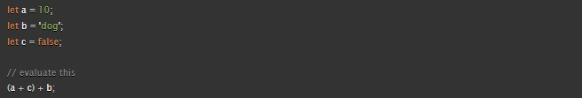

# ***Overview***

Before developers get to work designing websites, it's important they have ideal computer set ups, understand the basics, and apply solid programming fundamentals.  Understanding how to structure, style and animate webpages using HTML, CSS, and Javascript helps enhance users' experiences.  ***Arrays and loops also help developers interact with users.  Developers use both to create code that helps pull information and put it to use.  For example, correcting user responses.  Writing loops of code helps save time and minimizes errors.  Arrays help retrieve contained data for deployment.***

# Class 3 Assignment

1. When should you use an unordered list in your HTML document?

    The \<ul> element is for grouping a collection of items that do not have a numerical ordering, and their order in the list is meaningless. Typically, unordered-list items are displayed with a bullet, which can be of several forms, like a dot, a circle, or a square.

   [Source: mdn web docs](https://developer.mozilla.org/en-US/docs/Web/HTML/Element/ul)

2. How do you change the bullet style of unordered list items?

    The list-style-type property command is applied to the element.  From there, the user agent selects a bullet type depending on the nesting level of the list.

    [Source: mdn web docs](https://developer.mozilla.org/en-US/docs/Web/HTML/Element/ul)

3. Describe two ways you can change the numbers on list items provided by an ordered list?

    Developers change numbers on an ordered list by manipulating types.  You can change the type to type="1", which creates a numbered list starting from 1 or by changing the type "A", which creates a list numbered with uppercase letters starting from A.

    [Source: mdn web docs](https://developer.mozilla.org/en-US/docs/Web/HTML/Element/ol)

4. Describe the CSS properties of margin and padding as characters in a story. What is their role in a story titled: “The Box Model”?

    Margin and padding are secret service agents if the content were the President.  They push other elements away from the content as a form of protection.

   [Source: mdn web docs](https://developer.mozilla.org/en-US/docs/Learn/CSS/Building_blocks/The_box_model)

5. List and describe the four parts of an HTML elements box as referred to by the box model.

    Content box: The area where your content is displayed; size it using properties like inline-size and block-size or width and height.

    Padding box: The padding sits around the content as white space; size it using padding and related properties.

    Border box: The border box wraps the content and any padding; size it using border and related properties.

    Margin box: The margin is the outermost layer, wrapping the content, padding, and border as whitespace between this box and other elements; size it using margin and related properties.

    [Source: mdn web docs](https://developer.mozilla.org/en-US/docs/Learn/CSS/Building_blocks/The_box_model)

6. What data types can you store inside of an Array??

    Strings, numbers, objects, and even other arrays. You can also mix data types in a single array.

    [Source: mdn web docs](https://developer.mozilla.org/en-US/docs/Learn/JavaScript/First_steps/Arrays)

7. Is the people array a valid JavaScript array? If so, how can I access the values stored? If not, why?

    It's valid array however in order to access all items you'll have to seperate the items by category using const names = ['pete', 'Smith', 'Bill'] and run a for...of statement.

    [Source: mdn web docs](https://developer.mozilla.org/en-US/docs/Learn/JavaScript/First_steps/Arrays)

8. List five shorthand operators for assignment in javascript and describe what they do.

    Addition assignment (+=); adds the value of the right operand to a variable and assigns the result to the variable.

    Subtraction assignment (-=);  subtracts the value of the right operand from a variable and assigns the result to the variable.

    Multiplication assignment (*=); multiplies a variable by the value of the right operand and assigns the result to the variable.

    Division assignment (/=); divides a variable by the value of the right operand and assigns the result to the variable.

  [Source: mdn web docs](https://developer.mozilla.org/en-US/docs/Web/JavaScript/Guide/Expressions_and_Operators)

9. Read the code below and evaluate the last expression and explain what the result would be and why.

7c. Which components are considered properties?

color:
padding:  

 [Source: mdn web docs](https://developer.mozilla.org/en-US/docs/Learn/CSS/First_steps/How_CSS_is_structured)

8. What data type is a sequence of text enclosed in single quote marks?
string

9. List 4 types of JavaScript operators.

Addition
Subtraction, Multiplication, Division
Assignment
Strict equality

10. Describe a real world Problem you could solve with a Function.

Passing 201 = studying hard and completing all assignments on time

[Source: mdn web docs](https://developer.mozilla.org/en-US/docs/Learn/CSS/First_steps/How_CSS_is_structured)

11. An if statement checks a ***condtion*** and if it evaluates to ***true***, then the code block will execute.

12. What is the use of an else if?

Chain on extra choices/outcomes to your if...else statements

13. List 3 different types of comparison operators.

Arithmetic, increment/ decrement, and assignment

[Source: mdn web docs](https://developer.mozilla.org/en-US/docs/Learn/JavaScript/First_steps/Math#comparison_operators)

14. What is the difference between the logical operator && and ||?

They are logical operators which represent the AND and OR operations respectively.  

[mariusschulz.com](https://mariusschulz.com/blog/the-and-and-or-operators-in-javascript#:~:text=If%20applied%20to%20boolean%20values,true%20in%20all%20other%20cases)

## Things I want to know more about
