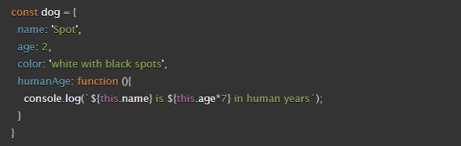

# ***Overview***

Before developers get to work designing websites, it's important they have ideal computer set ups, understand the basics, and apply solid programming fundamentals.  Understanding how to structure, style and animate webpages using HTML, CSS, and Javascript helps enhance users' experiences.  Arrays and loops also help developers interact with users.  Developers use both to create code that helps pull information and put it to use.  For example, correcting user responses.  Writing loops of code helps save time and minimizes errors.  Arrays help retrieve contained data for deployment.  Understanding HTML links, JS functions, and CSS layouts are important to know because as a developer, you'll be given problems to fix and knowing the areas well reduces time looking back through notes and having to research other's fixes, which may not be reliable to begin with.  Some problems you'll be called upon to troubleshoot are images and texts.  Learning to manipulate both makes user's web pages more appealing which increases more site visits and other metrics, e.g. views, hits, check-ins, etc.  ***Understanding Javascript objects helps developers save time when using functions in their code.  For example knowing when to use dot notations versus brackets and their advantages versus disadvantages. Constructors also save time.  They streamline the object process.  Having background knowledge about the document object model is important for developers to know because it gives them a visual representation of how their programming languages medify webpages.***

# Class 6 Assignment

1. How would you describe an object to a non-technical friend you grew up with?

    An object is like a toolbox.  In it you have a collection of named tools (properties) which you could use in a variety of different ways (methods).  

   [Source: mdn web docs](https://developer.mozilla.org/en-US/docs/Learn/JavaScript/Objects/Basics)

2. What are some advantages to creating object literals?

    Sending a single object is much more efficient than sending several items individually, and it is easier to work with than an array, when you want to identify individual items by name.  They're time savers.    

    [Source: mdn web docs](https://developer.mozilla.org/en-US/docs/Learn/JavaScript/Objects/Basics)

3. How do objects differ from arrays?

     Instead of using an index number to select an item, you are using the name associated with each member's value in an object.
    
    [Source: mdn web docs](https://developer.mozilla.org/en-US/docs/Learn/JavaScript/Objects/Basics)   

4. Give an example for when you would need to use bracket notation to access an object’s property instead of dot notation.

     If an object property name is held in a variable, then you can't use dot notation to access the value, but you can access the value using bracket notation.

   [Source: mdn web docs](https://developer.mozilla.org/en-US/docs/Learn/JavaScript/Objects/Basics)

5. Evaluate the code below. What does the term this refer to and what is the advantage to using this?

   

   The this keyword refers to the current object the code is being written inside — so in this case this is equivalent to dog.  When you only have to create a single object literal, it's not so useful. But if you create more than one, this enables you to use the same method definition for every object you create.

    [Source: mdn web docs](https://developer.mozilla.org/en-US/docs/Learn/JavaScript/Objects/Basics)

6. What is the DOM?

    The Document Object Model (DOM) is the data representation of the objects that comprise the structure and content of a document on the web.

    [Source: mdn web docs](https://developer.mozilla.org/en-US/docs/Web/API/Document_Object_Model/Introduction)

7. Briefly describe the relationship between the DOM and JavaScript.

The DOM is the canvas for Javascript.  It alllows Javascript and other programming languages to modify its representation.

[Source: mdn web docs](https://developer.mozilla.org/en-US/docs/Web/API/Document_Object_Model/Introduction)

## Things I want to know more about
